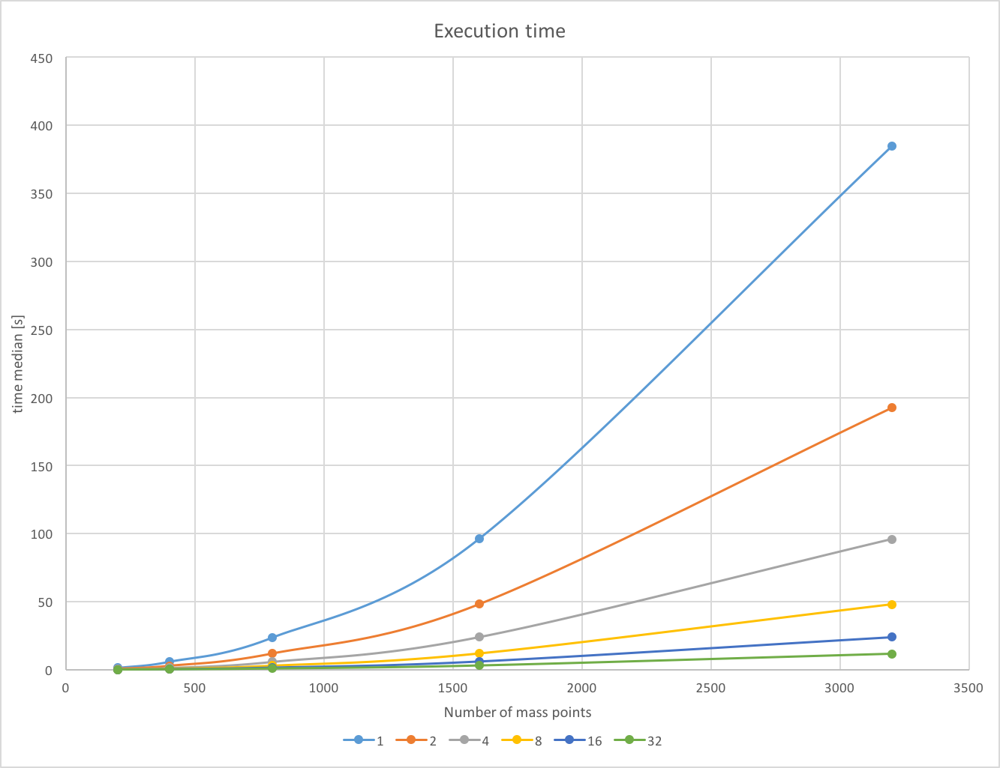
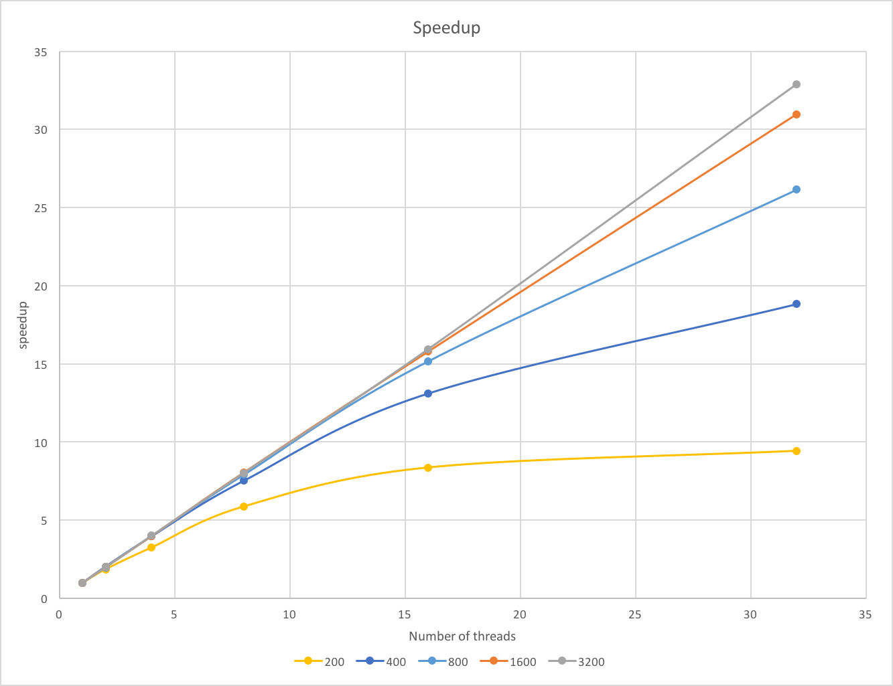

# Space simulator
Semestral project for B4M35PAG subject at FEE CTU in Prague, simulating movement of mass points in the space, inspired
by Kepler's laws of planetary motion. Project is writen in C++.

## How to run it?
Mandatory arguments:
- [0] input file (string)
- [1] output file (string)
- [2] number of iterations (int)
- [3] initial speed (double <0,1>, 0 = no speed, 1 = max speed)

Example: data/in_10000.txt data/out_10000x500_0.8.gif 500 0.8
Others parameters and flags (i.e.: PARALLEL, DEBUG, animation speed, GIF settings, etc.) 
can be changed in [setting.h](settings.h) file.

## Benchmarks
- Each execution was performed five times and the median value has been used.
- For raw data see docs dir.

### HW setup
- Metacentrum `zuphux.cerit-sc.cz`
- Intel(R) Xeon(R) CPU E7- 4860  @ 2.27GHz
- 80 physical cores

### How to reproduce it?
Just copy all the source files into you home directory on Metacentrum and execute command `qsub run_simulator.sh`. 
Then several executions will be performed with following configuration (each combination five times):
- threads in {1 2 4 8 16 32}
- instance sizes {200 400 800 1600 3200}

## Profiling
- Tools: Perf, Valgrind, KCacheGrind

### HW setup 
- Intel(R) Xeon(R) CPU E3-1220 v3 @ 3.10GHz
- 4 cores
- 16 GB RAM

### Results
- Bottleneck: 99.64% `doIteration()` method (22.3% force computations, 11.89% distance computations)
- For more detail see `/docs` dir.
